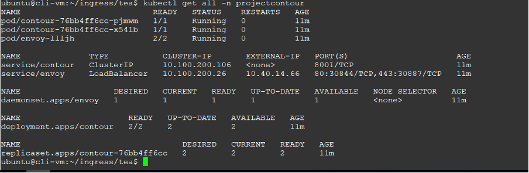
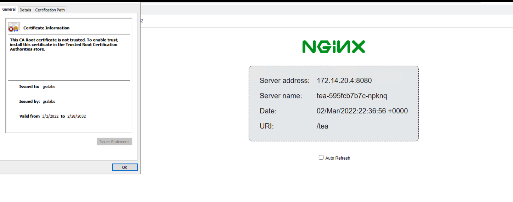

# Ingress with Contour and HTTPProxy and TLS Delegation

## Overview

### Contour
The Contour Ingress controller is a collaboration between:

Envoy, which provides the high performance reverse proxy.
Contour, which acts as a management server for Envoy and provides it with configuration.
These containers are deployed separately, Contour as a Deployment and Envoy as a Daemonset, although other configurations are possible.

In the Envoy Pods, Contour runs as an initcontainer in bootstrap mode and writes a bootstrap configuration to a temporary volume. This volume is passed to the
 Envoy container and directs Envoy to treat Contour as its management server.

After initialisation is complete, the Envoy container starts, retrieves the bootstrap configuration written by Contour’s bootstrap mode, and establishes a GRPC 
session with Contour to receive configuration.

### Steps

## Create Wild card Certs

The steps are for Ubuntu

Copy the openssl.cnf template We will be using gsslabs as our domain

> cp /usr/lib/ssl/openssl.cnf gsslabs.cnf

Change the following, to add SAN

```yaml
---
[ v3_req ]
basicConstraints = CA:FALSE
keyUsage = nonRepudiation, digitalSignature, keyEncipherment
subjectAltName = @alt_names

[ alt_names ]
DNS.1 = my-cluster.gsslabs.org
DNS.2 = *.gsslabs.org
```

Uncomment [req] section to create certificates with the v3 extension

> req_extensions = v3_req


#### Create Certs

> openssl genrsa -out gsslabs.key 2048

> openssl rsa -in gsslabs.key -out gsslabs.key.pem

Create a server cert using the  private key

> openssl req -new -subj "/CN=gsslabs" -key gsslabs.key.pem -out gsslabs.csr

Generate cert using csr

> openssl x509 -req -extensions v3_req -days 3650 -in gsslabs.csr -signkey gsslabs.key.pem -out gsslabs.crt -extfile gsslabs.cnf

Validate

> openssl x509 -in gsslabs.crt -text -noout


## Deploy Contour

> kubectl apply -f https://projectcontour.io/quickstart/contour.yaml

Check if contour is up and running


The ip of the load balancer for envoy would be our entry point



## Configure Secrets

Create a namespace

> kubectl create ns tlsadmin

Create a secret with the cert and key created in previous step

> kubectl create secret tls admin-tls-secret --key gsslabs.key --cert gsslabs.crt -n tlsadmin

 Create the TLS delegation (source under resources directoory)

```yaml
---
apiVersion: projectcontour.io/v1
kind: TLSCertificateDelegation
metadata:
  name: tsladmin-del
  namespace: tlsadmin
spec:
  delegations:
    - secretName: admin-tls-secret
      targetNamespaces:
      - "*"

---
```

## Create Apps 

Create a namespace for the tea app

> kubectl create ns tea

Create a namespace for the coffee app

> kubectl create ns coffee

Deploy the tea and coffee applications  (under apps folder)

> kubectl apply -f tea.yaml -n tea
> kubectl apply -f coffee.yaml -n coffee

```yaml
---
apiVersion: apps/v1
kind: Deployment
metadata:
  name: tea
spec:
  replicas: 3
  selector:
    matchLabels:
      app: tea
  template:
    metadata:
      labels:
        app: tea
    spec:
      containers:
      - name: tea
        image: nginxdemos/nginx-hello
        ports:
        - containerPort: 8080
---
apiVersion: v1
kind: Service
metadata:
  name: tea-svc
  labels:
spec:
  ports:
  - port: 80
    targetPort: 8080
    protocol: TCP
    name: http
  selector:
    app: tea

---
```

```yaml
apiVersion: apps/v1
kind: Deployment
metadata:
  name: coffee
spec:
  replicas: 2
  selector:
    matchLabels:
      app: coffee
  template:
    metadata:
      labels:
        app: coffee
    spec:
      containers:
      - name: coffee
        image: nginxdemos/nginx-hello
        ports:
        - containerPort: 8080
---
apiVersion: v1
kind: Service
metadata:
  name: coffee-svc
  labels:
spec:
  ports:
  - port: 80
    targetPort: 8080
    protocol: TCP
    name: http
  selector:
    app: coffee
---
```

## Create Http Proxies
The Ingress object was added to Kubernetes in version 1.1 to describe properties of a cluster-wide reverse HTTP proxy. Since that time, the Ingress API has remained relatively unchanged, and the need to express implementation-specific capabilities has inspired an explosion of annotations.

The goal of the HTTPProxy Custom Resource Definition (CRD) is to expand upon the functionality of the Ingress API to allow for a richer user experience as well addressing the limitations of the latter’s use in multi tenant environments.

Key HTTPProxy Benefits
Safely supports multi-team Kubernetes clusters, with the ability to limit which Namespaces may configure virtual hosts and TLS credentials.
Enables including of routing configuration for a path or domain from another HTTPProxy, possibly in another Namespace.
Accepts multiple services within a single route and load balances traffic across them.
Natively allows defining service weighting and load balancing strategy without annotations.
Validation of HTTPProxy objects at creation time and status reporting for post-creation validity.


Create a http proxy for the tea app (definitions under resources) with TLS delegation
 > kubectl apply tea-proxy.yml 

```yaml
apiVersion: projectcontour.io/v1
kind: HTTPProxy
metadata:
  name: tea-proxy
  namespace: tea
spec:
  virtualhost:
    fqdn: teas.gsslabs.org
    tls:
      secretName: tlsadmin/admin-tls-secret
  routes:
    - conditions:
      - prefix: /tea
      services:
        - name: tea-svc
          port: 80
---
```
Create a http proxy for the coffee app (definitions under resources) with TLS delegation

 > kubectl apply coffee-proxy.yml 

```yaml
apiVersion: networking.k8s.io/v1
kind: Ingress
metadata:
  annotations:
    projectcontour.io/tls-cert-namespace: tlsadmin
  name: coffee-ingress
  namespace: coffee
spec:
  rules:
  - host: coffees.gsslabs.org
    http:
      paths:
      - path: /coffee
        pathType: Prefix
        backend:
          service:
            name: coffee-svc
            port:
              number: 80
```

Configure DNS with the envoy proxy load balancer ip that was retrieved in the nitial step

eg. teas.gsslabs.org -- 10.40.14.66
& coffees.gsslabs.org -- 10.40.14.66

Test and verify from browser , also check cert




NOTE: If you would like to use the Ingress resource instead of the proxy the samples are provided under resources

